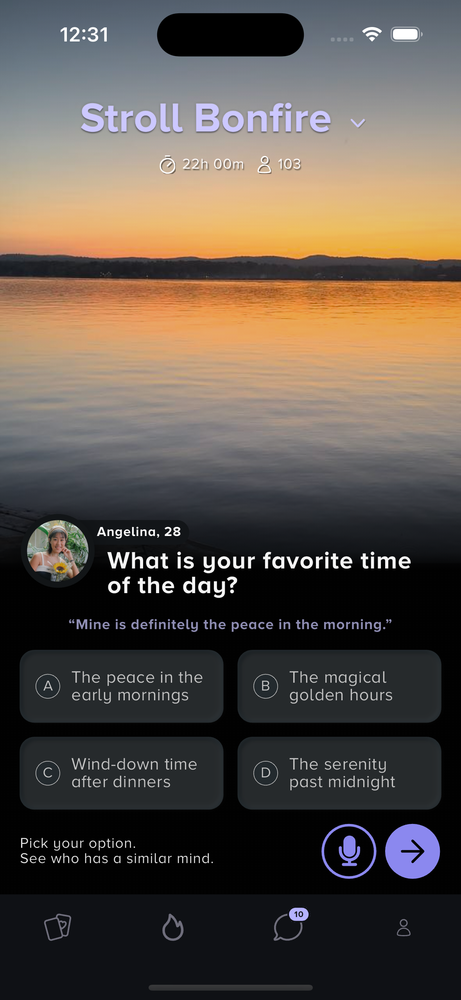

# stroll_task1

A new Flutter project.

## Getting Started

This project is a starting point for a Flutter application.


## Screenshot
Below is the screenshot of the homepage:



---

## Tech Stack
- **Flutter Version**: `3.24.3` (managed via FVM)
- **Dart SDK**: Compatible with Flutter version.
- **Packages Used**:
  - `flutter_svg`: For rendering SVG assets.
  - `fvm`: Flutter Version Management tool for version consistency.

---

## How to Run

### Prerequisites
1. Install Flutter (`3.24.3`) using FVM:
   ```bash
   fvm install 3.24.3
   fvm use 3.24.3